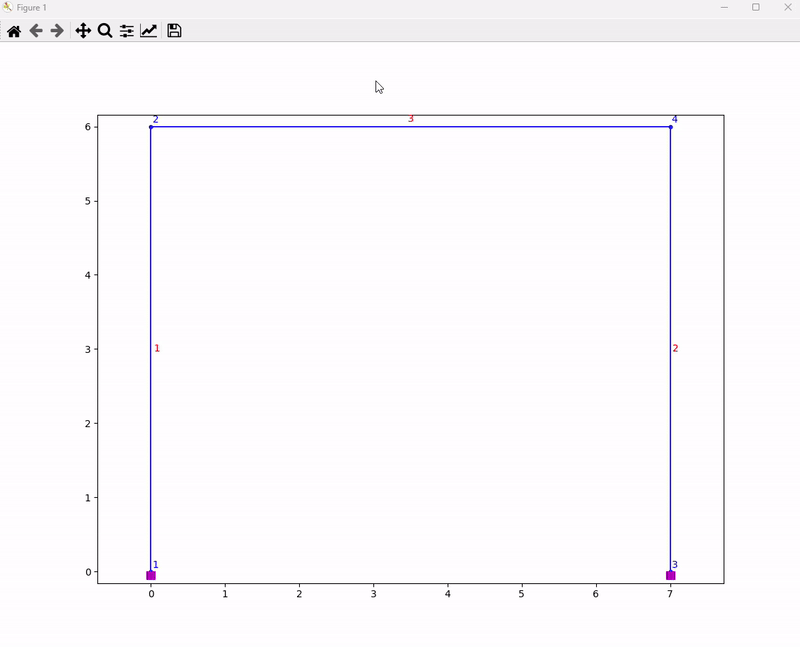

# OpsTooltip
Creates tooltip for nodes and elements from OpenSeesPy with mplcursors.

## Description
This script enables users to obtain information about nodes and elements by hovering over them. Initially, it generates a JSON file containing information about geometry i.e. nodes and elements. Subsequently, the script reads the node and element data from the JSON file. Finally, it utilizes [mplcursors](https://github.com/anntzer/mplcursors) to create tooltips, providing insights when users hover over nodes and elements during visualization.

The script uses Matplotlib's **ax** object as input, facilitating seamless integration with [opsvis](https://github.com/sewkokot/opsvis) (OpenSeesPy postprocessing and plotting module). Examples of 2D and 3D models are give in `example2D.py` and `example3D.py`, respectively.

Note:
- The tooltips are functional when figure is shown in a new window. You can use `%matplotlib qt` to change default inline display to a windows display in your Jupyter Notebook.
- You will require mplcursors, openseespy and numpy libraries. You can install these with a pip command `pip install -r requirements.txt`.

